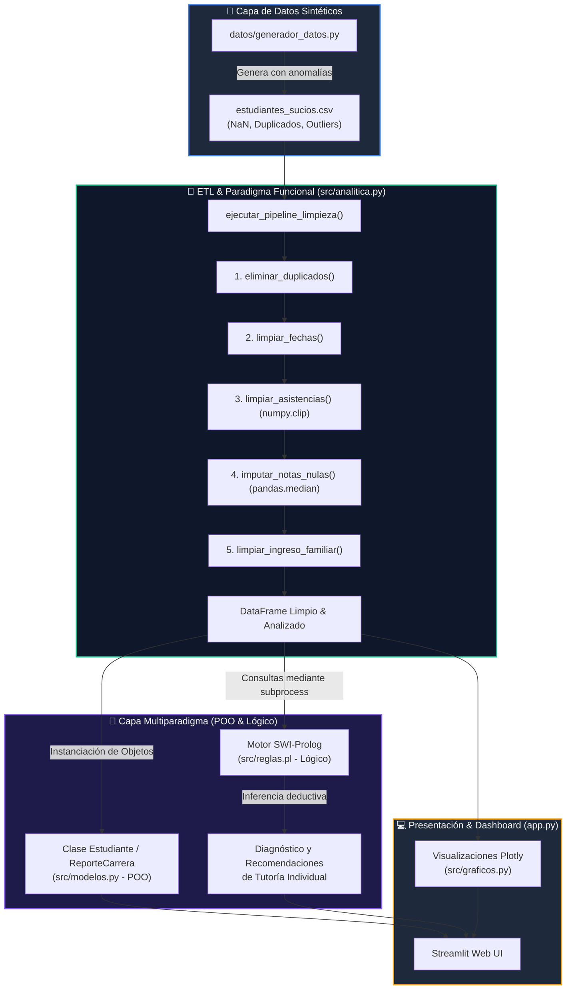

# 🎓 EduAnalytics - Dashboard Inteligente de Rendimiento Académico y Alerta de Deserción Escolar

[](https://www.python.org/)
[](https://streamlit.io/)
[](https://www.swi-prolog.org/)
[](https://docs.pytest.org/)
[](LICENSE)

**EduAnalytics** es una solución tecnológica multiparadigma desarrollada en **Python** y **SWI-Prolog** para la gestión universitaria, el análisis predictivo de datos escolares y la prevención temprana del riesgo de deserción estudiantil.

---

## 📌 Características Principales

* 📊 **Dashboard Interactivo:** Visualizaciones dinámicas con **Streamlit** y **Plotly** (histogramas, box plots, regresiones OLS y barras por carrera).
* 🧹 **Pipeline ETL Funcional (PF):** Tratamiento inmutable de datos sintéticos con **Pandas** y **NumPy** (`numpy.clip`, purga de duplicados e imputación por mediana).
* 🧩 **Modelado Orientado a Objetos (POO):** Encapsulamiento de alumnos y carreras profesionales mediante las clases `Estudiante` y `ReporteCarrera`.
* 🧠 **Motor de Inferencia Lógico (Prolog):** Deducción automática de niveles de riesgo y recomendaciones de tutoría personalizada a través de reglas en `src/reglas.pl` con fallback dinámico en Python.
* 🧪 **Aseguramiento de Calidad:** Pruebas unitarias automatizadas con `pytest` ($100\%$ de cobertura de lógica de negocio).

---

## 🏗️ Arquitectura del Sistema



---

## 📂 Estructura del Repositorio

```text
ProyectoLenguajesProgramacion/
├── app.py                      # Punto de entrada principal (Dashboard Streamlit)
├── datos/
│   ├── generador_datos.py      # Script de generación de datos sintéticos con anomalías
│   └── estudiantes_sucios.csv # Dataset inicial con duplicados, NaNs y outliers
├── src/
│   ├── analitica.py            # Pipeline ETL funcional, cálculo de riesgo y puente Prolog
│   ├── modelos.py              # Definición de clases POO (Estudiante y ReporteCarrera)
│   ├── graficos.py             # Generador de figuras y gráficos interactivos Plotly
│   └── reglas.pl               # Base de conocimientos y reglas inductivas en SWI-Prolog
├── tests/
│   └── test_analitica.py       # Pruebas unitarias automatizadas con Pytest
├── requirements.txt            # Dependencias del proyecto Python
└── README.md                   # Documentación principal del repositorio
```

---

## 🚀 Instalación y Ejecución

### 1. Requisitos Previos
* **Python 3.10** o superior.
* *(Opcional)* **SWI-Prolog** instalado en el sistema (`swipl`). Si no se encuentra instalado, el sistema activará automáticamente el *Modo Compatibilidad en Python*.

### 2. Instalación de Dependencias
Clona el repositorio e instala los paquetes requeridos:

```bash
git clone https://github.com/FrancoGPU/ProyectoLenguajesProgramacion.git
cd ProyectoLenguajesProgramacion
pip install -r requirements.txt
```

### 3. Iniciar el Dashboard Web
Ejecuta la aplicación web interactiva en Streamlit:

```bash
python -m streamlit run app.py
```
La aplicación se abrirá automáticamente en tu navegador web en `http://localhost:8501`.

## 🛠️ Comandos Útiles del Proyecto

A continuación se resumen los comandos principales para instalar, ejecutar, probar y administrar el proyecto:

| Acción / Propósito | Comando de Ejecución | Descripción |
| :--- | :--- | :--- |
| **Instalar Dependencias** | `pip install -r requirements.txt` | Instala Pandas, NumPy, Streamlit, Plotly, Pytest y Statsmodels. |
| **Iniciar Dashboard Web** | `python -m streamlit run app.py` | Inicia el servidor local de Streamlit y abre la aplicación en `http://localhost:8501`. |
| **Ejecutar Pruebas (Pytest)** | `python -m pytest tests/ -v -s` | Ejecuta las 6 pruebas unitarias con consola explicativa detallada. |
| **Regenerar Dataset Sintético** | `python datos/generador_datos.py` | Genera un nuevo archivo CSV con 1000 registros e inyección de datos sucios. |
| **Consola SWI-Prolog** | `& "C:\Program Files\swipl\bin\swipl.exe" -s src/reglas.pl` | Abre la consola de Prolog (Windows) cargando las reglas. |
| **Consulta Directa Prolog** | `& "C:\Program Files\swipl\bin\swipl.exe" -s src/reglas.pl -g "evaluar_estudiante(12,8,10,65,5,R,A,M,P,T), halt."` | Evalúa las reglas de un alumno desde la terminal de Windows. |

---

## 👥 Autores

* **Franco Paolo Garcia Urbano** - *Desarrollador* - [FrancoGPU](https://github.com/FrancoGPU)
* **Yonathan Edgar Jauregui Granados** - *Desarrollador*
* **Jefferson Jesus Lee Silva Zavala** - *Desarrollador*

**Curso:** Lenguajes de Programación  
**Docente:** Giusephy Hugo Valladares Peña  
**Institución:** Universidad Tecnológica del Perú (UTP) - 2026-I
